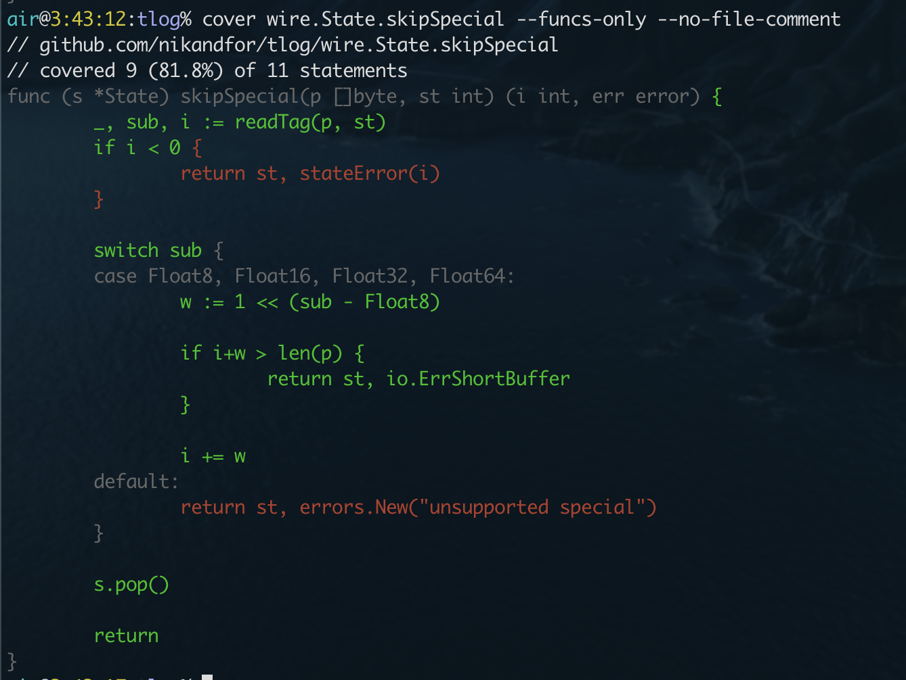

[](https://pkg.go.dev/github.com/nikandfor/cover?tab=doc)
[](https://circleci.com/gh/nikandfor/cover)
[](https://codecov.io/gh/nikandfor/cover)
[](https://goreportcard.com/report/github.com/nikandfor/cover)
[](https://github.com/nikolaydubina/go-recipes)


# cover
Go cover tool for maximum productivity.

It is similar to `go tool cover -html=cover.out` but not leaving the terminal. It was inspired by [gocovsh](https://github.com/orlangure/gocovsh) but I wanted it to work a bit different.

The aim is to help me in writing tests spending as little attention and key presses as possible.



### Key features

* You dont leave the terminal.
* It's non-interactive like ls, cd and most of cli commands. Life is too short to navigate menus.
* It's precise, it only output the code you asked.

### How to use

Go to the project dir, it requires to be inside the project to work (go.mod needed).

Create coverage profile as usual: `go test -coverprofile cover.out ./...`.

Render it `cover` (`cover.out` is the default profile name). By default it renders all files in the current directory recursive (`./...`).

But the best part is filters. You determine what coverage target you want, you may have simple rule (all files at least 80% covered) or as much flexible as you want (separate coverage target for each file, package or function, exclude experimental subpackages or unexported functions).

Then you may write your tests with very little distraction: no typing, no clicking, no switching to browser and back, very little of scrolling.

You may also use it as an automated checker as it can return exit code 1 if something is selected. You set the rules and eliminate what breaks them.
```
cover --exit-code <target_filters...> && echo "You are covered!" || echo "There is something to cover"
```

### Filters

Select by path. Paths are relative to the current directory.
```
. # not recursive
./wire
tlog.go
```

Select by package name, type name, function name or combined
```
wire
Encoder
AppendValue
wire.Encoder.AppendValue
github.com/nikandfor/tlog/ext/tlflag.OpenWriter
```

File filter is a glob, function filter is a regexp.
```
./ext/tl*

wire.Encoder.Append.+
```

Filter by coverage.
```
tlog.go:b70  # filter by file name, then by coverage: *b* for below, 70 is percent
             # Select all functions in a file with coverage below 70%

# there are 'b' (below) or 'l' (less then) and 'a' (above) or 'g' (greater then) filters

Logger:b80:a10  # all methods of Logger with coverage from 10% to 80%
:b80            # every function in the current directory covered below 80% recursive

# function coverage is compared by default, but if `...` wildcard path filter suffix is used then file total coverage is compared.

wire:l80     # functions with less than 80% coverage
ext/...:l80  # files with less than 80% total coverage
```

Negative filter. Filter prefixed with `!` unselects previously selected functions.
```
!unsafe.go
!./ext/...

!tq/parse
!tlog.[a-z].+
```

Filter chaining.
```
# quotes to prevent shell substitution

./ext/... '!tlgraylog'                 # extensions except tlgraylog
./wire/ '!Encoder' '!Decoder' '!:a80'  # functions in wire package except Encoder and Decoder methods and except well covered
...:b80                                # files to cover
```

*Examples are from [tlog](https://github.com/nikandfor/tlog/).*
